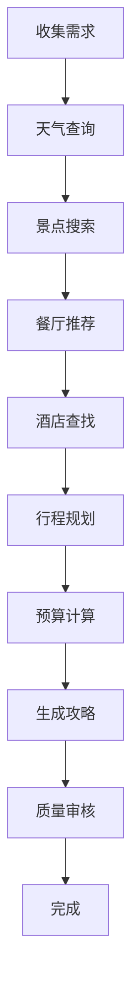

# 🗺️ MCP智能旅游规划系统

基于**高德地图API**和**多智能体协同**的智能旅游攻略生成系统。

---

## 📁 文件说明

### 1. `mcp_travel_planner.py` - 基础版（asyncio并行）

**功能特点**：
- ✅ 高德地图POI搜索
- ✅ 实时天气查询
- ✅ 美食餐厅推荐
- ✅ 酒店住宿建议
- ✅ 路线智能规划
- ✅ 多智能体并行协同

**智能体团队**：
```
🤖 天气顾问 ──┐
🏛️ 景点专家 ──┼── 并行执行 ──> 📝 总规划师 ──> 📄 完整攻略
🍽️ 美食顾问 ──┤
🏨 住宿顾问 ──┘
```

---

### 2. `mcp_travel_langgraph.py` - 高级版（LangGraph工作流）

**功能特点**：
- ✅ 结构化工作流
- ✅ 动态决策支持
- ✅ 预算智能计算
- ✅ 行程优化建议
- ✅ 支持用户反馈和修改

**工作流程**：


---

## 🚀 快速开始

### 步骤1: 配置环境

#### 1.1 安装依赖
```bash
pip install requests
pip install langgraph  # 如果使用LangGraph版本
```

#### 1.2 获取高德地图API密钥

1. 访问 [高德开放平台](https://lbs.amap.com/)
2. 注册/登录账号
3. 创建应用
4. 获取Web服务API密钥

#### 1.3 配置.env文件
```env
# OpenAI配置（已有）
OPENAI_API_KEY1=your_openai_key
OPENAI_BASE_URL=your_base_url

# 高德地图API密钥（新增）
AMAP_API_KEY=your_amap_api_key_here
```

---

### 步骤2: 运行程序

#### 方法1：基础版（更快）
```bash
python chapter08-A2A/mcp_travel_planner.py
```

#### 方法2：高级版（更结构化）
```bash
python chapter08-A2A/mcp_travel_langgraph.py
```

---

## 💡 使用示例

### 示例1：周末北京游

```python
result = await planner.plan_travel(
    destination="北京",
    duration="3天2晚",
    preferences="对历史文化感兴趣，喜欢传统美食"
)
```

**输出示例**：
```markdown
D:\Anaconda\envs\tellme\python.exe D:\Garfield_Lyu\postgraduate\project\langchain\chapter08-A2A\mcp_travel_planner.py 

================================================================================
 🗺️  MCP智能旅游规划系统 - 基于高德地图
================================================================================

📌 功能特色：
  ✅ 实时天气查询
  ✅ 智能景点推荐
  ✅ 美食餐厅搜索
  ✅ 酒店住宿建议
  ✅ 路线智能规划
  ✅ 多智能体协同

================================================================================

================================================================================
🗺️  MCP旅游规划系统启动
================================================================================
📍 目的地: 北京
⏱️  时长: 3天2晚
💭 偏好: 对历史文化感兴趣，喜欢传统美食
================================================================================

                         🔍 阶段1：信息收集                         
================================================================================

============================================================
🤖 [天气顾问] 开始工作: 查询北京未来3天的天气情况
============================================================

============================================================
🤖 [景点专家] 开始工作: 推荐北京最值得游览的5个景点，对历史文化感兴趣，喜欢传统美食
============================================================

============================================================
🤖 [美食顾问] 开始工作: 推荐北京最受欢迎的特色美食和餐厅
============================================================

============================================================
🤖 [住宿顾问] 开始工作: 推荐北京性价比高的酒店
============================================================
✅ [天气顾问] 完成任务 (耗时: 6.10s)

✅ [住宿顾问] 完成任务 (耗时: 12.01s)

✅ [景点专家] 完成任务 (耗时: 18.45s)

✅ [美食顾问] 完成任务 (耗时: 26.84s)


                        🗺️  阶段2：路线规划                        
================================================================================

============================================================
🤖 [景点专家] 开始工作: 基于以下景点信息，规划3天2晚的游览路线：
在北京，以下五个景点非常值得游览，特别适合对历史文化感兴趣的游客，同时也能享受到传统美食：

1. **故宫博物院**
   - **地址**: 景山前街4号
   - **评分**: 4.9
   - **简介**: 故宫是中国古代皇宫，拥有丰富的历史和文化遗产。这里不仅可以欣赏到古代建筑的壮丽，还能了解中国的历史文化。
   - **美食推荐**: 在故宫附近有许多传统餐馆，可以尝试北京炸酱面和宫保鸡丁等经典美食。

2. **中国国家博物馆**
   - **地址**: 东长安街16号天安门广场东侧
   - **评分**: 4.9
   - **简介**: 该博物馆展示了中国悠久的历史和文化，是了解中国历史的重要场所。
   - **美食推荐**: 附近有许多小吃摊，可以尝试北京的豆汁和焦圈。

3. **烟袋斜街**
   - **地址**: 地安门外大街48号
   - **评分**: 4.7
   - **简介**: 这是一个充满传统文化氛围的街区，街道两旁有许多特色商店和小吃摊，适合漫步和购物。
   - **美食推荐**: 在这里可以找到各种传统小吃，如糖葫芦和炸春卷。

4. **故宫博物院-交泰殿**
   - **地址**: 景山前街4号故宫博物院内(北侧)
   - **评分**: 3.7
   - **简介**: 交泰殿是故宫内的一部分，展示了清代的宫廷文化和历史。
   - **美食推荐**: 游览后可以在故宫附近的餐馆享用传统的宫廷菜。

5. **国家自然博物馆**
   - **地址**: 天桥南大街126号
   - **评分**: 4.7
   - **简介**: 该博物馆展示了自然历史和生物多样性，是一个适合家庭游览的地方。
   - **美食推荐**: 附近有许多地道的北京小吃，如炸酱面和羊肉串。

这些景点不仅能让你深入了解北京的历史文化，还能让你品尝到丰富的传统美食。希望你在北京的旅行愉快！
============================================================
✅ [景点专家] 完成任务 (耗时: 16.93s)


                         📝 阶段3：生成攻略                         
================================================================================
📋 正在整合信息，生成完整攻略...


================================================================================
✅ 旅游规划完成 (总耗时: 67.84秒)
================================================================================


================================================================================
📄 完整旅游攻略
================================================================================
# 北京 3天2晚旅游攻略

## 📋 行程概览

- **第1天**：故宫博物院 → 交泰殿 → 烟袋斜街
- **第2天**：中国国家博物馆 → 国家自然博物馆
- **第3天**：自由活动与购物

---

## 📅 每日详细安排

### 第一天：故宫博物院与周边

**上午**
- **09:00 - 13:00**：游览 **故宫博物院**
  - 地址：景山前街4号
  - 建议游览时间：3-4小时
  - 重点参观：太和殿、乾清宫、御花园等。

**中午**
- **13:00 - 14:00**：午餐
  - **美食推荐**：在故宫附近的餐馆享用北京炸酱面和宫保鸡丁。

**下午**
- **14:00 - 15:00**：游览 **交泰殿**
  - 地址：景山前街4号故宫博物院内(北侧)
  - 建议游览时间：1小时

**傍晚**
- **15:30 - 17:30**：游览 **烟袋斜街**
  - 地址：地安门外大街48号
  - 建议游览时间：2小时
  - 品尝特色小吃：糖葫芦和炸春卷。

**晚餐**
- **18:00 - 19:30**：在烟袋斜街附近的餐馆享用晚餐。

**住宿**
- **推荐酒店**：北京海湾半山酒店
  - 地址：密溪路36号
  - 评分：4.7

---

### 第二天：博物馆之旅

**上午**
- **09:00 - 13:00**：游览 **中国国家博物馆**
  - 地址：东长安街16号天安门广场东侧
  - 建议游览时间：3-4小时

**中午**
- **13:00 - 14:00**：午餐
  - **美食推荐**：在国家博物馆附近的小吃摊尝试北京的豆汁和焦圈。

**下午**
- **14:30 - 17:00**：游览 **国家自然博物馆**
  - 地址：天桥南大街126号
  - 建议游览时间：2-3小时

**傍晚**
- **17:30 - 19:00**：返回酒店休息或在附近的餐馆享用晚餐。

**住宿**
- **推荐酒店**：夯妈有个小院子民宿
  - 地址：南大路西白岱村公交站南白岱站北

---

### 第三天：自由活动与购物

**上午**
- **09:00 - 12:00**：自由活动
  - 可选择重游感兴趣的景点或在周边的商店购物。

**中午**
- **12:00 - 13:00**：午餐
  - 推荐尝试羊肉串和其他地道小吃。

**下午**
- 根据航班或火车时间，适当安排离开北京的行程。

---

## 💰 预算参考

| 项目         | 预算 (人民币) |
|--------------|----------------|
| 住宿         | 600-1200       |
| 餐饮         | 300-500        |
| 交通         | 100-200        |
| 景点门票     | 200-300        |
| **总计**     | **1200-2200**  |

---

## ⚠️ 注意事项

1. **购票**：建议提前在线购票，尤其是故宫和国家博物馆，以避免排队。
2. **天气变化**：根据天气变化适时调整行程和穿着。
3. **公共交通**：建议使用公共交通工具，方便快捷。

---

## 💡 实用建议

- **穿着**：11月初天气较凉，建议准备轻便的外套和保暖衣物。
- **现金与支付**：北京大部分地方接受支付宝和微信支付，但也建议携带适量现金。
- **语言**：虽然大部分景点和餐馆都有英文标识，但学习一些简单的中文问候语会使您的旅行更加顺利。

希望您在北京的旅行愉快，享受历史文化与美食的完美结合！

================================================================================


🎯 进入交互模式（输入'exit'退出）


请输入旅游信息：
  目的地城市: exit

👋 感谢使用，祝您旅途愉快！


进程已结束，退出代码为 0

```

---

## 🔧 核心功能详解

### 1. 高德地图POI搜索

```python
@tool
def search_poi(city: str, keyword: str, poi_type: str = "") -> str:
    """搜索景点、餐厅、酒店等"""
    # 调用高德地图API
    # 返回详细的POI信息
```

**支持的POI类型**：
- 🏛️ 旅游景点
- 🍽️ 餐饮服务
- 🏨 住宿服务
- 🛍️ 购物服务
- 🚇 交通设施

---

### 2. 实时天气查询

```python
@tool
def get_weather(city: str) -> str:
    """查询未来3天天气"""
    # 返回温度、天气、风向等信息
```

---

### 3. 路线规划

```python
@tool
def get_route(origin_city, origin_poi, dest_city, dest_poi, mode) -> str:
    """规划出行路线"""
    # 支持驾车、公交、步行
```

---

## 🆚 两个版本对比

| 特性 | 基础版 (asyncio) | 高级版 (LangGraph) |
|-----|-----------------|-------------------|
| **执行速度** | ⭐⭐⭐⭐⭐ | ⭐⭐⭐⭐ |
| **代码复杂度** | 简单 | 中等 |
| **工作流可视化** | ❌ | ✅ |
| **动态决策** | ❌ | ✅ |
| **预算计算** | 基础 | 详细 |
| **用户交互** | 简单 | 高级 |
| **适用场景** | 快速生成攻略 | 复杂旅游规划 |

---

## 🎯 高级功能

### 1. 智能预算计算

根据：
- 旅游天数
- 酒店等级
- 餐饮标准
- 景点门票

自动计算详细预算。

---

### 2. 个性化推荐

支持多种偏好：
- 🏛️ 历史文化
- 🌳 自然风光
- 🍜 美食体验
- 👨‍👩‍👧 亲子游乐
- 🏃 运动健身

---

### 3. 动态行程优化

- ✅ 考虑景点距离
- ✅ 避免来回奔波
- ✅ 合理安排时间
- ✅ 天气影响调整

---

## 📊 数据来源

### 高德地图提供：
- POI（兴趣点）数据
- 天气信息
- 路线规划
- 地理编码

### AI智能体负责：
- 信息筛选
- 行程安排
- 内容生成
- 优化建议

---

## ⚠️ 注意事项

### 1. API限制
- 高德地图个人开发者有调用限额
- 建议合理使用，避免频繁调用
- 可配置缓存机制

### 2. 数据准确性
- POI信息可能过时
- 建议出行前再次确认
- 营业时间可能变化

### 3. 成本控制
- OpenAI API按token收费
- 高德地图API有免费额度
- 合理控制调用频率

---

## 🔮 未来扩展

### 计划功能：
- [ ] 添加携程/去哪儿酒店比价
- [ ] 集成12306火车票查询
- [ ] 支持多城市联游
- [ ] 添加旅游保险推荐
- [ ] 实时航班信息
- [ ] 用户评价系统
- [ ] 攻略分享功能
- [ ] 智能问答助手

---

## 📚 API文档

### 高德地图API

#### POI搜索
```python
GET https://restapi.amap.com/v3/place/text
参数:
  - key: API密钥
  - keywords: 搜索关键词
  - city: 城市名称
  - types: POI类型
```

#### 天气查询
```python
GET https://restapi.amap.com/v3/weather/weatherInfo
参数:
  - key: API密钥
  - city: 城市名称
  - extensions: all(未来天气)
```

#### 路线规划
```python
GET https://restapi.amap.com/v3/direction/driving
参数:
  - key: API密钥
  - origin: 起点坐标
  - destination: 终点坐标
```

---

## 🐛 故障排除

### 问题1：API密钥错误
```
错误: 未找到相关POI，可能原因：API密钥无效
解决: 检查.env中AMAP_API_KEY是否正确
```

### 问题2：网络超时
```
错误: 搜索出错: timeout
解决: 检查网络连接，或增加timeout参数
```

### 问题3：无结果返回
```
错误: 未找到相关POI
解决: 
1. 检查城市名称是否正确
2. 尝试更换搜索关键词
3. 确认该城市是否有相关POI
```

---

## 🎓 学习建议

### 学习路径：
1. **基础** - 学习单智能体 (`googleSearch.py`)
2. **进阶** - 学习并行协同 (`multi_agent_async.py`)
3. **高级** - 学习MCP基础版 (`mcp_travel_planner.py`)
4. **专家** - 学习LangGraph版 (`mcp_travel_langgraph.py`)

### 实践建议：
1. 先在演示模式下测试
2. 获取真实API密钥
3. 从简单查询开始
4. 逐步增加复杂度
5. 添加自定义功能

---

## 📞 技术支持

- 高德地图开放平台：https://lbs.amap.com/
- LangChain文档：https://python.langchain.com/
- LangGraph文档：https://langchain-ai.github.io/langgraph/

---

**作者**: lgf  
**日期**: 2025/10/31  
**版本**: 1.0.0  
**环境**: conda环境tellme