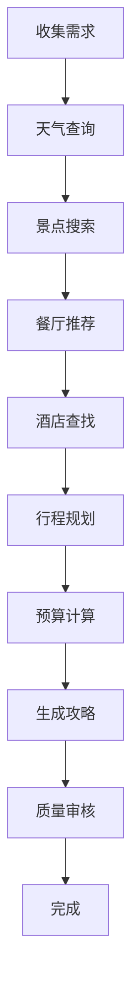

# 🗺️ MCP智能旅游规划系统

基于**高德地图API**和**多智能体协同**的智能旅游攻略生成系统。

---

## 📁 文件说明

### 1. `mcp_travel_planner.py` - 基础版（asyncio并行）

**功能特点**：
- ✅ 高德地图POI搜索
- ✅ 实时天气查询
- ✅ 美食餐厅推荐
- ✅ 酒店住宿建议
- ✅ 路线智能规划
- ✅ 多智能体并行协同

**智能体团队**：
```
🤖 天气顾问 ──┐
🏛️ 景点专家 ──┼── 并行执行 ──> 📝 总规划师 ──> 📄 完整攻略
🍽️ 美食顾问 ──┤
🏨 住宿顾问 ──┘
```

---

### 2. `mcp_travel_langgraph.py` - 高级版（LangGraph工作流）

**功能特点**：
- ✅ 结构化工作流
- ✅ 动态决策支持
- ✅ 预算智能计算
- ✅ 行程优化建议
- ✅ 支持用户反馈和修改

**工作流程**：


---

## 🚀 快速开始

### 步骤1: 配置环境

#### 1.1 安装依赖
```bash
pip install requests
pip install langgraph  # 如果使用LangGraph版本
```

#### 1.2 获取高德地图API密钥

1. 访问 [高德开放平台](https://lbs.amap.com/)
2. 注册/登录账号
3. 创建应用
4. 获取Web服务API密钥

#### 1.3 配置.env文件
```env
# OpenAI配置（已有）
OPENAI_API_KEY1=your_openai_key
OPENAI_BASE_URL=your_base_url

# 高德地图API密钥（新增）
AMAP_API_KEY=your_amap_api_key_here
```

---

### 步骤2: 运行程序

#### 方法1：基础版（更快）
```bash
python chapter08-A2A/mcp_travel_planner.py
```

#### 方法2：高级版（更结构化）
```bash
python chapter08-A2A/mcp_travel_langgraph.py
```

---

## 💡 使用示例

### 示例1：周末北京游

```python
result = await planner.plan_travel(
    destination="北京",
    duration="3天2晚",
    preferences="对历史文化感兴趣，喜欢传统美食"
)
```

**输出示例**：
```markdown
# 北京 3天2晚旅游攻略

## 📋 行程概览
- 目的地：北京
- 时长：3天2晚
- 主题：历史文化 + 传统美食

## 🌤️ 天气预报
- 第1天：晴，15-25°C
- 第2天：多云，14-24°C
- 第3天：晴，16-26°C

## 📅 详细安排

### Day 1 - 故宫·天安门
- 09:00 - 天安门广场
- 10:30 - 故宫博物院（预计3小时）
- 13:00 - 午餐：全聚德烤鸭
- 15:00 - 景山公园
- 18:00 - 晚餐：老北京炸酱面
- 住宿：XX酒店（近王府井）

### Day 2 - 长城·明十三陵
- 07:00 - 出发前往八达岭长城
- 09:00 - 长城游览（3小时）
- 12:30 - 午餐：农家菜
- 14:00 - 明十三陵
- 18:00 - 返回市区
- 晚餐：护国寺小吃

### Day 3 - 胡同·798
- 09:00 - 南锣鼓巷
- 11:00 - 什刹海
- 13:00 - 午餐：姚记炒肝
- 15:00 - 798艺术区
- 17:00 - 返程

## 💰 预算明细
- 交通：约500元/人
- 住宿：约400元/人
- 餐饮：约450元/人
- 门票：约300元/人
- 其他：约200元/人
- **总计：约1850元/人**

## ⚠️ 注意事项
1. 提前网上订票，避免排队
2. 长城建议穿运动鞋
3. 准备防晒用品
4. 下载离线地图

## 💡 实用建议
- 使用北京一卡通，方便出行
- 避开节假日高峰
- 提前预约故宫门票
```

---

## 🔧 核心功能详解

### 1. 高德地图POI搜索

```python
@tool
def search_poi(city: str, keyword: str, poi_type: str = "") -> str:
    """搜索景点、餐厅、酒店等"""
    # 调用高德地图API
    # 返回详细的POI信息
```

**支持的POI类型**：
- 🏛️ 旅游景点
- 🍽️ 餐饮服务
- 🏨 住宿服务
- 🛍️ 购物服务
- 🚇 交通设施

---

### 2. 实时天气查询

```python
@tool
def get_weather(city: str) -> str:
    """查询未来3天天气"""
    # 返回温度、天气、风向等信息
```

---

### 3. 路线规划

```python
@tool
def get_route(origin_city, origin_poi, dest_city, dest_poi, mode) -> str:
    """规划出行路线"""
    # 支持驾车、公交、步行
```

---

## 🆚 两个版本对比

| 特性 | 基础版 (asyncio) | 高级版 (LangGraph) |
|-----|-----------------|-------------------|
| **执行速度** | ⭐⭐⭐⭐⭐ | ⭐⭐⭐⭐ |
| **代码复杂度** | 简单 | 中等 |
| **工作流可视化** | ❌ | ✅ |
| **动态决策** | ❌ | ✅ |
| **预算计算** | 基础 | 详细 |
| **用户交互** | 简单 | 高级 |
| **适用场景** | 快速生成攻略 | 复杂旅游规划 |

---

## 🎯 高级功能

### 1. 智能预算计算

根据：
- 旅游天数
- 酒店等级
- 餐饮标准
- 景点门票

自动计算详细预算。

---

### 2. 个性化推荐

支持多种偏好：
- 🏛️ 历史文化
- 🌳 自然风光
- 🍜 美食体验
- 👨‍👩‍👧 亲子游乐
- 🏃 运动健身

---

### 3. 动态行程优化

- ✅ 考虑景点距离
- ✅ 避免来回奔波
- ✅ 合理安排时间
- ✅ 天气影响调整

---

## 📊 数据来源

### 高德地图提供：
- POI（兴趣点）数据
- 天气信息
- 路线规划
- 地理编码

### AI智能体负责：
- 信息筛选
- 行程安排
- 内容生成
- 优化建议

---

## ⚠️ 注意事项

### 1. API限制
- 高德地图个人开发者有调用限额
- 建议合理使用，避免频繁调用
- 可配置缓存机制

### 2. 数据准确性
- POI信息可能过时
- 建议出行前再次确认
- 营业时间可能变化

### 3. 成本控制
- OpenAI API按token收费
- 高德地图API有免费额度
- 合理控制调用频率

---

## 🔮 未来扩展

### 计划功能：
- [ ] 添加携程/去哪儿酒店比价
- [ ] 集成12306火车票查询
- [ ] 支持多城市联游
- [ ] 添加旅游保险推荐
- [ ] 实时航班信息
- [ ] 用户评价系统
- [ ] 攻略分享功能
- [ ] 智能问答助手

---

## 📚 API文档

### 高德地图API

#### POI搜索
```python
GET https://restapi.amap.com/v3/place/text
参数:
  - key: API密钥
  - keywords: 搜索关键词
  - city: 城市名称
  - types: POI类型
```

#### 天气查询
```python
GET https://restapi.amap.com/v3/weather/weatherInfo
参数:
  - key: API密钥
  - city: 城市名称
  - extensions: all(未来天气)
```

#### 路线规划
```python
GET https://restapi.amap.com/v3/direction/driving
参数:
  - key: API密钥
  - origin: 起点坐标
  - destination: 终点坐标
```

---

## 🐛 故障排除

### 问题1：API密钥错误
```
错误: 未找到相关POI，可能原因：API密钥无效
解决: 检查.env中AMAP_API_KEY是否正确
```

### 问题2：网络超时
```
错误: 搜索出错: timeout
解决: 检查网络连接，或增加timeout参数
```

### 问题3：无结果返回
```
错误: 未找到相关POI
解决: 
1. 检查城市名称是否正确
2. 尝试更换搜索关键词
3. 确认该城市是否有相关POI
```

---

## 🎓 学习建议

### 学习路径：
1. **基础** - 学习单智能体 (`googleSearch.py`)
2. **进阶** - 学习并行协同 (`multi_agent_async.py`)
3. **高级** - 学习MCP基础版 (`mcp_travel_planner.py`)
4. **专家** - 学习LangGraph版 (`mcp_travel_langgraph.py`)

### 实践建议：
1. 先在演示模式下测试
2. 获取真实API密钥
3. 从简单查询开始
4. 逐步增加复杂度
5. 添加自定义功能

---

## 📞 技术支持

- 高德地图开放平台：https://lbs.amap.com/
- LangChain文档：https://python.langchain.com/
- LangGraph文档：https://langchain-ai.github.io/langgraph/

---

**作者**: lgf  
**日期**: 2025/10/31  
**版本**: 1.0.0  
**环境**: conda环境tellme